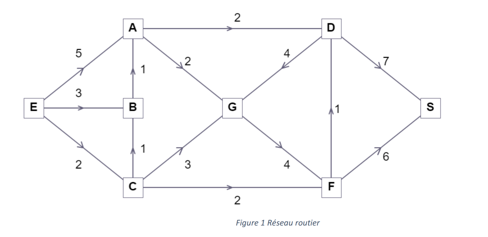
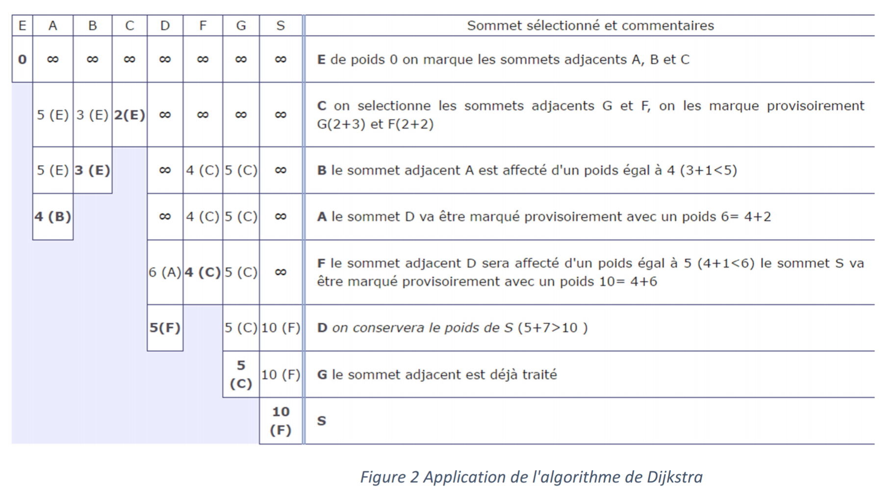

# TP3

<!--- TODO: Changer la date de remise en modifiant le URL--->
#### :alarm_clock: [Date de remise](https://www.timeanddate.com/countdown/generic?iso=20210131T2359&p0=165&msg=Remise&font=cursive&csz=1#)

## Partie 1: Introduction aux fonctions
Cette partie est relativement simple, et a pour but de vous échauffer pour la partie 2 du TP ! Celle-ci consiste en une introduction aux lectures/écritures de fichier, en implémentant un algorithme de tri simple. 

### Le but: 
Trier les éléments d'un tableau en ordre croissant par l'algorithme de tri par sélection.

### Description: 
1. On recherche le plus petit élément de la zone de tri. Au départ, cette zone couvre l'ensemble du tableau. Lorsque durant notre recherche, on identifie un élément qui pourrait être le plus petit élément du tableau, on retient sa position (l'indice de la case du tableau)
2. Si, à la suite de cette recherche, on s'aperçoit que le plus petit élément du tableau n'est pas au sommet de la zone de tri, on échange la valeur située au sommet du tableau et celle du plus petit élément du tableau.
3. On réduit la zone de tri en excluant le sommet de la zone de tri précédente.
4. On recommence au point 1 tant et aussi longtemps que la zone de tri contient plus d'un élément.

### Visualisation de l'algorithme
Cette vidéo permet de bien visualiser le fonctionnement de l'algorithme de tri par sélection.

### Notes
* Le fichier *listeDeNombres.txt* vous est fourni, et contient des lignes contenant des séquences de nombre à trier. Ces nombres sont séparés par des *espaces*, et les lignes par des *sauts de ligne*. La dernière ligne du fichier est une ligne vide.
* Les résultats doivent être enregistrés dans le fichier *resultats.txt*, sous la même forme qu'ils sont présentés dans le fichier *listeDeNombres.txt* (mais triés !), soit une séquence de nombre (par ligne) séparés par des espaces, avec un saut de ligne à la fin.
* Le *main* n'a pas besoin d'être modifié, seulement les fonctions *lireFichier()*, *sauvegarderListesTriees(chemin, nom, listeTriees)* et *trierListe(listeATrier)*
* Des instructions textuelles vous sont données pour vous indiquer quels sont les changements à effectuer.

### Pour aller plus loin
Dans le cadre de votre cheminement à Polytechnique, plus spécifiquement dans les cours *Structures de données et algorithmes(INF2010)* et *Analyse et conception d'algorithmes(INF8775)*, vous aurez l'occasion d'approfondir les différents algorithmes (incluant les algorithmes de tri !). Si vous désirez en savoir plus, voici un [vidéo](https://www.youtube.com/watch?v=kPRA0W1kECg&ab_channel=TimoBingmann) démontrant le fonctionnement visuel de différents algorithmes de tri.
Toutefois, il existe une variété assez impressionante d'algorithmes de tri. Pour un peu d'humour et de culture info-logienne, vous pouvez consulter cette [page](https://codoholicconfessions.wordpress.com/2017/05/21/strangest-sorting-algorithms/) pour découvrir quelques-uns d'entre-eux. 

## Partie 2: Dijskstra - Amusons-nous avec un classsique!

Passons aux choses sérieuses. Pour ce 2e exercice vous expérimenterez avec un des algorithmes les plus connus en informatique. Comme beaucoup d'algorithmes, son fonctionnement peut sembler obscur à première vue. Ce n'est qu'en l'implémentant que vous aurez une vue d'ensemble sur son fonctionnement et peut-être alors vous réaliserez que la logique est plutôt simple. C'est d'ailleurs ce qui en fait son efficacité.

En 1959, [E. W. Dijkstra](https://en.wikipedia.org/wiki/Edsger_W._Dijkstra) (1930-2002), encore à ce jour une des figures ayant le plus influencé les sciences informatiques, s'est attaqué à un problème classique en optimisation, le [problème du plus court chemin](https://fr.wikipedia.org/wiki/Probl%C3%A8me_de_plus_court_chemin). C'est un problème dont les applications sont très larges, répondant à des questions toujours actuelles comme:

* Quelles routes dois-je prendre pour arriver le plus vite possible à mon entrevue ce matin?
* Comment router le plus efficacement entre deux appareils une série de fichiers à travers internet?

Dijsktra a donc proposé un [algorithme](https://en.wikipedia.org/wiki/Dijkstra%27s_algorithm) qui permet de trouver le plus court chemin entre deux point dans un graphe. Par exemple, il permet de trouver le chemin le plus court entre deux villes en considérant différentes
villes et le réseau routier qui les lient. On propose dans cet exercice d’implémenter cet algorithme.

> Un exemple de dijsktra en action, dans un contexte ou les distances entre les points sont toujours de "1".

Explication de l’algorithme :
Soit le réseau routier donné par la *Figure 1*. Les villes sont données par les nœuds (A-G, E, S). Chaque route
est représentée par un arc orientée qui donne le sens de circulation et la distance entre les deux villes
connectés. On cherche à travers cet exemple de trouver le plus court chemin de la ville E à S.

Pour résoudre ce problème, Dijkstra s’est basé sur le principe suivant : Si le court chemin de   à   passe respectivement par deux villes notées  et  alors le segment qui lie   à   est le plus court chemin de   à . Le plus court chemin peut être ainsi construit de proche en proche en choisissant à chaque étape un sommet   tel que la longueur allant de  à  est connu être provisoirement la plus courte possible. 

L’algorithme de Dijkstra est structuré suivant le pseudocode suivant :

- Etape 1 (Phase d’initialisation) : On considère un tableau **distances** dont la taille est le nombre de nœuds du réseau; il représente la plus courte distance trouvée *jusqu’à maintenant* entre  et ce nœud. On met la case correspondante au sommet  à  (la distance entre  et lui-même est nulle) et les autres à  pour dire qu’on n’a pas encore trouvé comment se rendre à ce nœud, et sera considéré comme une distance infinie dans l’algorithme. 

- **nœuds** = l’ensemble de tous les nœuds 
- **TANT QUE nœuds** n’est pas vide **FAIRE**
  - Étape 2 :  = trouver l’élément de **nœuds** le plus proche de **E** selon **distances**. 
  - Étape 3 : **POUR** chaque **nœud**  adjacent à  **FAIRE**
      - mettreAJourDistance (, ), qui vérifie si passer par  permet de réduire la longueur du trajet allant à , et modifie distances si c’est le cas.
  - Étape 4 : Enlever  de **nœuds**; le tableau **distances** contient actuellement la distance
minimale de  à . 
    
L’application pas à pas de l’algorithme sur l’exemple de la *Figure 1* est donnée par la *Figure 2*. Chaque ligne représente le même tableau **distances** (tableau 1D) à une itération différente de la boucle dans l’algorithme. Les cases en bleu (dont la valeur est omise sur la figure) conservent la valeur précédente, ce sont les cases où la distance est déjà minimale. La lettre entre parenthèses indique le sommet précédent duquel on arrive pour aller à ce nœud, et en gras est indiqué le nœud sélectionné comme étant le plus proche de **E** (à l’étape 2 de l’algorithme).  

Pour coder cet algorithme, on définit deux structures, *Tableau* (liste 1D) et *Matrice* (lsite 2D); voir le fichier *ex1.py*, qui vous est fourni. La structure *Tableau* est utilisée pour représenter les données suivantes : 
  - *distances* : distances calculée des différents nœuds par rapport à la source (est mis à jour graduellement en fonction des nouveaux chemins trouvés). On attribue la valeur -1 pour un chemin pas encore trouvé (distance infinie dans la *Figure 2*).
  - *predecesseurs* : le prédécesseur de chaque ville dans le chemin le plus court trouvé jusqu’à maintenant. Un predecesseur non encore défini est représentée par la valeur -1, la source elle-même n’ayant pas de prédécesseur aura aussi la valeur -1.
  - *nœuds* : un tableau pour représenter l’ensemble **noeuds** défini dans le pseudocode de l’algorithme de Dijkstra présenté précédamment. Comme il sert à représenter un ensemble, au sens mathématique, l’ordre des éléments dans ce tableau n’a pas d’importance. Les valeurs dans cet ensemble sont les indices dans les tableaux *distances* et *predecesseurs*. 
  
La structure *Matrice* sert à représenter la matrice des poids, c’est-à-dire les distances entre villes voisines dans le graphe. Dans cette matrice, la case **[x][y]** est la longueur de la route directe de la ville *x* vers la ville *y*. La valeur -1 indique qu’il n’y a pas de route directe entre ces villes.

Pour la représentation des noeuds, on considère les indices de *0* à *n-1*, plutôt que des lettres comme dans l’exemple ci-dessus. À titre d’exemple, en considérant les nœuds de la *Figure 1* en ordre alphabétique, l’élément d’indice *0* est le nœud *A*. 
  

Directives particulières
* Dans chaque programme vous pouvez ajouter d’autres fonctions à celles décrites dans l’énoncé, ainsi que
d’autres structures (et sous-structures), pour améliorer la lisibilité et suivre le principe DRY (Don’t Repeat
Yourself). À chaque endroit où vous remarquez une duplication de code (vous avez écrit les mêmes
opérations plus d’une fois) et qu’il n’est pas possible de l’éliminer avec ce qui a été vu en cours, indiquez-le
en commentaire.
* Il est interdit d’afficher directement ou indirectement dans les fonctions décrites si la description n’indique
pas d’affichage.
* Respecter le guide de codage, les points pertinents pour ce travail sont donnés en annexe à la fin.

## Partie 2.1: Ajoutons un peu de vérifications

### correction_tp_3
[corrigé_tp_3](https://www.youtube.com/watch?v=dQw4w9WgXcQ)
